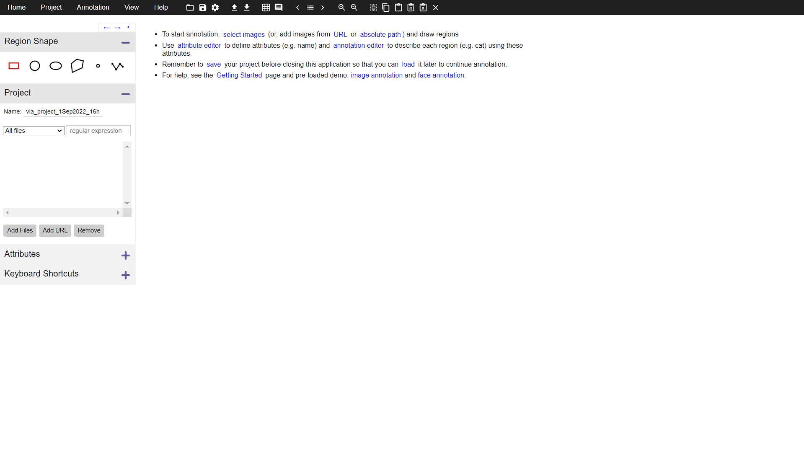

# End-to-End AI Model Development for Coral Lifeforms Coverage Area Prediction

author: Ashry Ramadhan

### Overview

1. Environment Setup
    * Miniconda
    * Visual Studio Code
    * Jupyter Notebook
2. Dataset Annotation using VGG Image Annotator (VIA)
3. Dataset Preprocessing
    * Vialib Package Introduction
    * Dataset Reading
    * Dataset Visualization
    * Dataset Augmentation & Transformation
    * Dataset Splitting
    * Dataset Convertion
4. Semantic Segmentation
    * Semantic Segmentation Introduction
    * Binary Classification in Semantic Segmentation
    * Multi-Classification in Semantic Segmentation
5. AI Model Development using MMSegmentation Framework
    * Preparing Dataset and Folder Structure
    * Training Model
    * Evaluating Model
    * Model Convertion
    * Testing Converted Model

## 1. Environment Setup
### 1.1. Miniconda
Miniconda is a free minimal installer for conda. It is a small, bootstrap version of Anaconda that includes only conda, Python, the packages they depend on, and a small number of other useful packages, including pip, zlib and a few others [[https://docs.conda.io/en/latest/miniconda.html](https://docs.conda.io/en/latest/miniconda.html)].

#### **Creating Conda Environment**

> **syntax**: `conda create --name <conda-environment-name> python=3.8`

example:
```console
conda create --name ai python=3.8
```

#### **Activate Conda Environment**

> **syntax**: `conda activate <conda-environment-name>`

example:
```console
conda activate ai
```

#### **Deactivate Conda Environment**

> **syntax**: `conda deactivate`

example:
```console
conda deactivate
```

#### **Installing PIP**
```console
conda install -c anaconda pip
```

#### Download the Dependency
download this text file first: <https://github.com/ashryramadhan10/vialib/blob/main/requirements.txt>, after that, go to the file location, then create conda environment:
```console
conda create --name ai --file requirements.txt
```
then activate the environment:
```console
conda activate ai
```

### 1.2. Visual Studio Code
Visual Studio Code is a great Code Editor with many features and extentions, one of the extention is the most powerfull extention like Intellicode (AI-assisted development), code snippet almost for any programming languages, and many more advantageous, so that is why we are using this Code Editor.

you can download it from here: [https://code.visualstudio.com/](https://code.visualstudio.com/)

### 1.3. Jupyter Notebook
Jupyter (formerly IPython Notebook) is an open-source project that lets you easily combine Markdown text and executable Python source code on one canvas called a notebook. Visual Studio Code supports working with Jupyter Notebooks natively, and through Python code files.

you can install it using this syntax:
```console
pip install jupyter
pip install ipykernel
```

test open it using VS Code `Ctrl+Shift+P` and choose `Create: New Jupyter Notebook`

---

## 2. Dataset Annotation using VGG Image Annotator (VIA)


1. Set project name on the sidebar
2. Select **Region Shape** you want to use (Rectangular, Circle, Elliptical, Polygon, Point, and Polyline)
3. Click `Add Files` button to add image files you want annotate
4. Setting **Attributes**
5. Start annotating

Shortcuts:
* `d`: delete annotation
* `->`: next image
* `<-`: previous image
* `Ctrl+Scroll Up`: Zoom in
* `Ctrl+Scroll Down`: Zoom out

---

## 3. Data Preprocessing

### 3.1. Vialib Package Introduction
Vialib is an open source library written in Python for helping you to do image augmentation, visualize your dataset annotations (in polygon or bounding box), convert to various most used formats in computer vision model such as YOLOv4, YOLOv5, Pascal VOC, ICCV09, COCO 2017, and Semantic Segmentation Mask from Vgg Image Annotator (VIA) version 2.0.11 JSON files format.

you can check it on <https://github.com/ashryramadhan10/vialib>

### 3.1. Dataset Reading
### Polygons Format
```python
from vialib.dataset import DatasetPolygon

dataset = DatasetPolygon(input_dir='DATASET/', output_dir='OUTPUT/', annotation_file_name='annotation.json')
```

### Bounding Boxes Format
```python
from vialib.dataset import DatasetBoundingBox

dataset = DatasetBoundingBox(input_dir='DATASET/', output_dir='OUTPUT/', annotation_file_name='annotation.json')
```

### 3.2. Dataset Visualization
### Polygons Format
* `opacity` -> **float** (0 - 1): opactiy of the mask
* `cols` -> **int** : number of columns
* `image_start` -> **int** : (you can use this when randomenss is False), starting index to plot image
* `num_of_sample` -> **int** : number of images you want to display
* `color_dict` -> **dict** : color dictionary if you want to display your dataset with specific color based on its class
* `without_bboxes` -> **boolean** : show without bounding boxes
* `randomness` -> **int** : chose image randomly to be displayed

example:
```python
# display randomly, no color dictionary, and no bounding bboxes
dataset.plot_dataset(opacity=0.5, cols=10, num_of_samples=10, without_bboxes=True)

# display with color dictionary
color_dict = {
    'class_1': [255, 0, 0],
    'class_2': [0, 255, 0],
    'class_3': [0, 0, 255],
}
dataset.plot_dataset(opacity=0.5, cols=10, num_of_samples=10, color_dict=color_dict, without_bboxes=True)

# display with bounding boxes
dataset.plot_dataset(opacity=0.5, cols=10, num_of_samples=10, color_dict=color_dict, without_bboxes=False)

# display in consecuitve manner (randomness = False)
dataset.plot_dataset(opacity=0.5, cols=5, image_start=0, num_of_samples=10, color_dict=color_dict, without_bboxes=True, randomness=False)
```

### Bounding Boxes Format
same with polygons but there is no `opacity`, this argument is changed with `thickness`
* `thickness` -> **int** : the thickness of bounding box
* `cols` -> **int** : number of columns
* `image_start` -> **int** : (you can use this when randomenss is False), starting index to plot image
* `num_of_sample` -> **int** : number of images you want to display
* `color_dict` -> **dict** : color dictionary if you want to display your dataset with specific color based on its class
* `without_bboxes` -> **boolean** : show without bounding boxes
* `randomness` -> **int** : chose image randomly to be displayed
example:
```python
# display randomly, no color dictionary, and no bounding bboxes
dataset.plot_dataset(thickness=5, cols=10, num_of_samples=10)

# display with color dictionary
color_dict = {
    'class_1': [255, 0, 0],
    'class_2': [0, 255, 0],
    'class_3': [0, 0, 255],
}
dataset.plot_dataset(thickness=5, cols=10, num_of_samples=10, color_dict=color_dict)

# display in consecuitve manner (randomness = False)
dataset.plot_dataset(thickness=5, cols=5, image_start=0, num_of_samples=10, color_dict=color_dict, randomness=False)
```

### 3.3. Dataset Augmentation & Transformation
**Augmentation**: augmenting your dataset using [albumentations](https://albumentations.ai/) or [imgaug](https://imgaug.readthedocs.io/en/latest/), e.g:
### Augmentation
```python
import albumentations as A
import imgaug.augmenters as iaa

augment_albumentations = A.Compose([
    ... # here your transformation functions
])
dataset.augment(aug=augment_albumentations, aug_engine='albumentations', repeat=1)

augment_imgaug = iaa.Sequential([
... # here your transformation functions
])
dataset.augment(aug=augment_imgaug, aug_engine='imgaug', repeat=1)
```
> `augment` function arguments:
> * `aug` -> A.Compose or iaa.Sequential object
> * `aug_engine` -> str : 'albumentations' or 'imgaug augmentation package
> * `repeat` -> unsigned int : to generate more images based on how many times this argument is set

### Transform
```python
import albumentations as A
import imgaug.augmenters as iaa

transform_albumentations = A.Compose([
    ... # here your transformation functions
])
dataset.transform(tf=transform_albumentations, aug_engine='albumentations', add_name='', numeric_file_name=False, repeat=1)

transform_imgaug = iaa.Sequential([
    ... # here your transformation functions
])
dataset.transform(tf=transform_imgaug, aug_engine='imgaug', add_name='', numeric_file_name=False, repeat=1)
```
> `transform` function arguments:
> * `tf` -> A.Compose or iaa.Sequential object
> * `aug_engine` -> str : 'albumentations' or 'imgaug augmentation package
> * `add_name` -> str: (optionaly, default is '') if you want to add prefix to your images filename
> * `numeric_file_name` -> boolean: if you set this True, your images filename will change to numerical format (1 to n where n is nb. of your dataset)
> * `repeat` -> unsigned int : to generate more images based on how many times this argument is set

### 3.4. Dataset Splitting
`split_train_test` function arguments:
* `class_list` -> list : list of your object classes
* `regex_list` -> list : list of your regex list to get your object classes
* `train_ratio` -> float (0 - 1) : your train dataset ratio
```python
class_list = ['dataset', 'dataset', 'dataset']
regex_list = [r'class_1_\d+\.jpg', r'class_2_\d+\.jpg', r'class_3_\d+\.jpg']
dataset.split_train_test(class_list=class_list, regex_list=regex_list, train_ratio=0.8)

# or

class_list = ['class_1', 'class_2', 'class_3']
regex_list = [r'class_1_\d+\.jpg', r'class_2_\d+\.jpg', r'class_3_\d+\.jpg']
dataset.split_train_test(class_list=class_list, regex_list=regex_list, train_ratio=0.8)
```

### 3.5. Dataset Convertion
this package can convert VIA json file to various format, e.g:
```python
# convert to YOLOv4 format
dataset.convert_to_yolo_format()

# convert to YOLOv5 format
class_map = {
    0: 'class_1',
    1: 'class_2',
    3: 'class_3',
    ...
    n: 'class_n',
}
dataset.convert_to_yolov5_format(class_map)

# convert to Pascal VOC format
dataset.convert_to_pascalvoc_format()

# convert to Binary Semantic Segmentation Mask format
dataset.convert_to_binary_semantic_segmentation_format()

# convert to ICCV09 format (Multiclass Semantic Segmentation Mask)
class_color_dict = {
    'class_1': {'color': [255, 0, 0], 'index': 0},
    'class_2': {'color': [0, 255, 0], 'index': 1},
    'class_3': {'color': [0, 0, 255], 'index': 2},
    ...
    'class_n': {'color': [(0-255), (0-255), (0-255)], 'index': (uint)},
}
dataset.convert_to_iccv09_format(class_color_dict)
```

---

## 4. Semantic Segmentation
The semantic segmentation is to group the pixels in the image according to the prediction of semantic meaning that is to assign a label for each pixel, and to complete the tasks of simultaneous image segmentation and multi-object classification [1].

### 4.2. Binary Classification Task in Semantic Segmentation
What is Binary Classification ? binary means 2 (two), so Binary Classification is a task of classifiying two classes / groups of data. Binary Classification in Semantic Segmentation means we classifiying between the object we interested in with others, e.g:

#### Raw Image


#### Image Mask


### 4.3. Multi-Classification in Semantic Segmentation

Multi-Classification means we have more than 2 (two) classes that need to be classified, why differentiated these classification tasks? because the method for Binary Classification Task is different from Multi-Classification Task, take an example from the annotations (segmentation maps) of the dataset for the Multi-Classification Task are looks different:

#### Raw Image


#### Image Mask


---

## 5. AI Model Development using MMSegmentation Framework

For this training, we are going to use an open source framework called MMSsegmentation from OpenMMLab, you can check it on github: <https://github.com/open-mmlab/mmsegmentation>.

We are trying to do Multi-Classification Semantic Segmentation, we are going to use the pre-annotated dataset, I provide it on my github through this link: <https://github.com/ashryramadhan10/End-to-End-AI-Model-Development-for-Coral-Lifeforms-Coverage-Area-Prediction/dataset>

Then, you need to download the `mmsegmentation.ipynb` file too, it's provided by the above link too, this file is used for training and inferencing our model later.

## 5.1. Preparing Dataset Into Google Drive
After downloading the dataset, you just need to upload it into your Google Drive, we are going to use it later with Google Colab.

## 5.2. Google Colab
Google Colab is used to run our scripts for training the AI Model, Evaluating, Visualizing, and so on. You just need to upload the `mmsegmentation.ipynb` file too Google Colab.

# We Are Ready Now! 🚀

---

## References:
* [1] [Jinchao Shan et al, 2018, Semantic Segmentation Based on Deep Convolutional Neural Network, IOP Conf. Series: Journal of Physics: Conf. Series 1069 (2018) 012169](https://www.researchgate.net/publication/327330378_Semantic_Segmentation_Based_on_Deep_Convolution_Neural_Network)

